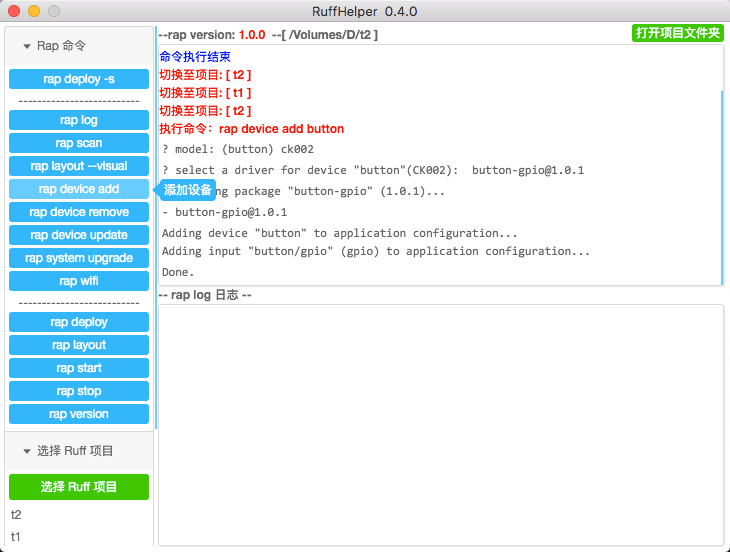

#RuffHelper
一个 Ruff 开发辅助工具，把常用的 rap 命令可视化操作。
使用 React + Electron 框架。

###[发布日志 v0.4.0](doc/ReleaseNotes.MD)

###原理
工作原理很简单，就是使用 node 子进程调用 rap 的命令,然后把返回的消息显示出来。

master 分支为稳定的发布版

dev 分支为开发调试版本，不保证能正常编译

###调试开发流程
npm install 安装各种包,需要翻墙，可以使用 [cnpm](https://npm.taobao.org/)

1. npm run dev 启动 webpack，自动编译 react
2. npm run start 启动 electron
3. happy coding

###[发布流程](doc/publish.MD)

###todo list
1. 自动更新，不需要每次重新下载整个应用的包

###发布版本地址
[git最大附件25M，只能放百度网盘了](http://pan.baidu.com/s/1kVRI98b#path=%252Fruffhelper)

