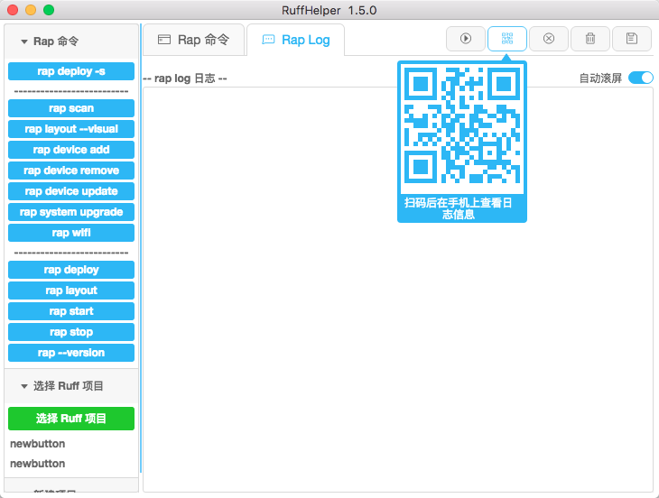

#RuffHelper
一个 Ruff 开发辅助工具，把常用的 rap 命令可视化操作。
使用 React + Electron 框架，webpack 编译。

[Ruff -- 用 js 开发智能硬件](https://ruff.io/zh-cn/)

###[发布日志 v1.5.0](doc/ReleaseNotes.MD)

###原理
工作原理很简单，就是使用 node 子进程调用 rap 的命令,然后把返回的消息显示出来。

###注意
master 分支为开发调试版本，我在重构代码，重新制作动态UI。如果需要稳定的版本，请使用1.5.0的Tag

###调试开发流程
1. **npm install** 安装各种包,有的需要翻墙，可以使用 [cnpm](https://npm.taobao.org/)
2. **npm install electron@1.5.0 -g** 全局安装 electron
3. **npm run dev** 启动 webpack，自动编译 react
4. **npm run start** 启动 electron
5. happy coding

###[发布流程](doc/publish.MD)

###发布版本地址
[git最大附件25M，只能放百度网盘了](http://pan.baidu.com/s/1kVRI98b#path=%252Fruffhelper)

