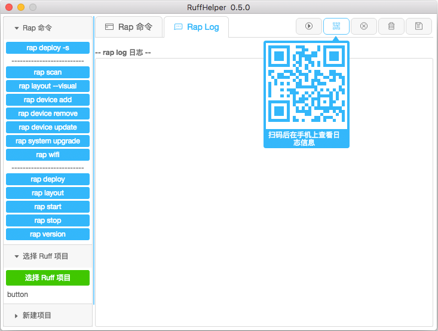
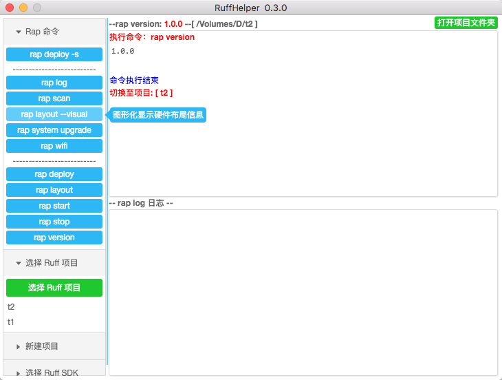

####v0.5.0
2016.7.13 发布
1.界面调整，把 rap log 部分和 rap command 分开了
2.rap log 区域增加清除日志的功能
3.rap log 区域增加保存日志的功能
4.rap log 区域增加二维码功能，可以在手机上查看日志

####v0.4.0
2016.5.27 发布

这个版本的 rap 命令很完善了，基本可以替代命令行。
支持最新的 ruff sdk 1.1.0。老版本的 ruff sdk 不确定能正否常使用。

1. 子进程调用方式改为 spawn ，让 rap log 更稳定
2. 增加 rap device add 添加设备的命令
3. 增加 rap device remove 移除设备的命令
4. 增加 rap device update 更新设备的命令
5. 大量细节优化，详情请看doc/工作日志.txt

####v0.3.0
2016.5.2 发布

1. 打通了rap scan、rap wifi、固件更新等复杂交互的功能。
2. 鼠标移到rap 命令上会有相应的提示
3. 增加拷贝黏贴等快捷操作
4. 因为我只有一块板子，没测试过 rap scan 多块开发板时是否能正常使用

####v0.2.0
2016.4.23 发布

功能基本没变化。主要完成了自动化构建exe和dmg安装包的功能

####v0.1.0
2016.4.15 发布

主要架构搭建完成。

实现功能有：

1. 创建 Ruff 项目
2. 选择 Ruff SDK
3. rap deploy -s
4. rap version
5. rap log 
